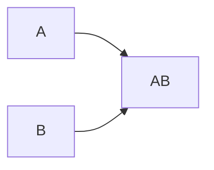
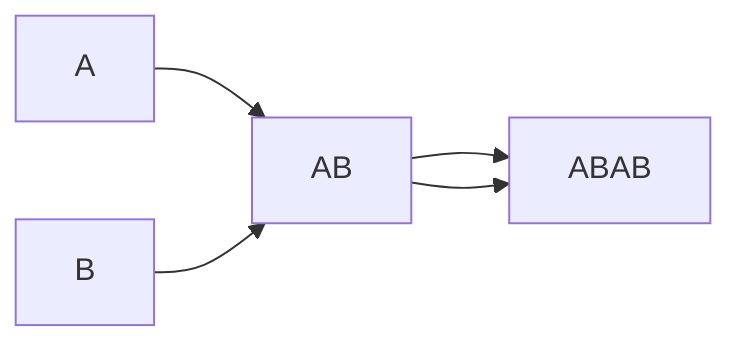
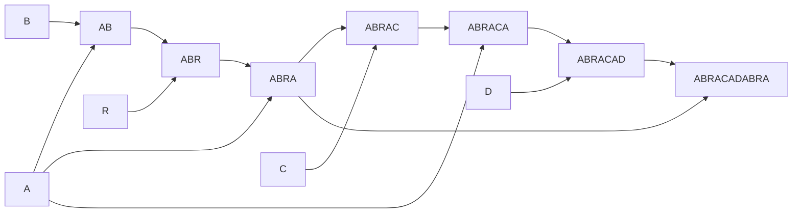

# asm-index

CURRENTLY NOT WORKING CORRECTLY!!!

**Work in Progress** Assembly theory search to compute the shortest path to assemble an object. The key assumption is that each assembled object can be reused down the causal chain again with a cost of 1.

Here I've written a python program that uses bfs + the assembley theory assumptions to generate the shortest path to assemble an object. I then output the number and the graph (which can be displayed in markdown like below).

> The actual principles and ideas for the examples come from the [Cronin Group](https://www.chem.gla.ac.uk/cronin/).

> [!WARNING]
> Since I do a naive search, each depth I increase exponentially, so very quickly
> even at a string length of 20, running this becomes impossible.

### `AB`

Assembly index of `1`

### `ABAB`

Assembly index of `2`

### `ABRACADABRA`

Assembly index of `7`

## TODO

- [x] Simple bfs/djikstras search for strings like above
- [x] Simple bfs/djikstras search for strings like above
- [ ] Tricks to optimize memory and speed for strings
- [ ] Write in a faster language (perhaps C, C++, Rust, or Mojo) and compile to wasm for a live visualization
- [ ] See if there are any new adjustments/shortcuts to search with the assembley theory assumptions
